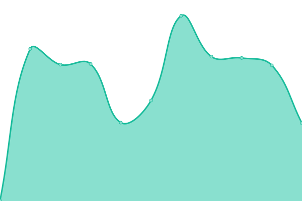

## [📈 Live Status](https://status.shulert.com): <!--live status--> **🟩 All systems operational**

<!--start: status pages-->
| URL | Status | History | Response Time | Uptime |
| --- | ------ | ------- | ------------- | ------ |
| [Shulert Website](https://www.shulert.com) | 🟩 Up | [shulert-website.yml](https://github.com/Shulert/status/commits/master/history/shulert-website.yml) |  347ms | 
| [Shulert API](https://api.shulert.com/status/api) | 🟩 Up | [shulert-api.yml](https://github.com/Shulert/status/commits/master/history/shulert-api.yml) |  261ms | 
| [Shulert Database](https://api.shulert.com/status/db) | 🟩 Up | [shulert-database.yml](https://github.com/Shulert/status/commits/master/history/shulert-database.yml) |  42ms | 
| [Shulert CDN](https://i.shulert.com) | 🟩 Up | [shulert-cdn.yml](https://github.com/Shulert/status/commits/master/history/shulert-cdn.yml) |  206ms | 
<!--end: status pages-->
